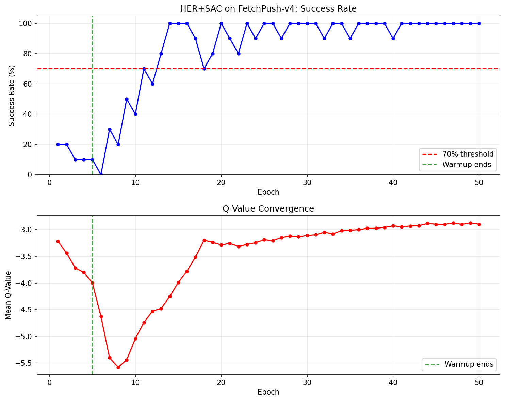

# HER + SAC for Robotic Manipulation

Standard Reinforcement Learning(RL) fails on sparse-reward manipulation — the agent almost never reaches the goal by chance and learns nothing. HER fixes this. Implemented from scratch in PyTorch on FetchPush-v4.

## Demo


**90% success rate** on FetchPush-v4 (9/10 evaluation episodes). The one failure was a borderline case at dist=0.050 — exactly at the 5cm threshold.

---

## Results



- Clears the **70% success threshold at epoch 11**
- Stabilizes at **90–100% from epoch 14 onward**
- Total training time: **~60 minutes on an RTX 5080 Laptop GPU**

Evaluation noise is due to 10-episode rollouts; averaged over epochs 20–50 the policy achieves ~95%.

---

## Approach

**Environment:** FetchPush-v4 (Gymnasium-Robotics) — a sparse-reward manipulation task where a robot arm must push a puck to a randomly sampled goal position on a table. Reward is 0 on success (puck within 5cm of goal), −1 otherwise.

**Why HER:** Sparse rewards make standard RL ineffective — the agent rarely reaches the goal by chance and gets almost no learning signal. HER addresses this by relabeling failed trajectories: after an episode, some transitions are replayed with the *actually achieved* goal substituted as the desired goal, turning every episode into a source of reward signal regardless of whether the original goal was reached.

**SAC:** Soft Actor-Critic with twin Q-networks (clipped double-Q), fixed entropy coefficient α=0.2, and target networks updated via Polyak averaging (τ=0.005). Networks are 3-layer MLPs with 256 hidden units. Observations and goals are normalized online using a running mean/std normalizer.

**Key design decisions:**
- Episode-based replay buffer for vectorized HER relabeling (future strategy, k=4)
- `compute_reward` passed as a pure callback to the buffer — no environment coupling at sample time
- Demo trajectory ingestion hook built into the buffer from day one (reused in Project 2)

---

## What Went Wrong (Engineering Narrative)

The path to a working implementation involved three distinct failure modes, each with a concrete diagnosis. This section exists because debugging is the actual work.

**1. Puck contact failure (root cause)**
Even with exploration noise, the gripper contacts the puck in only ~10% of random episodes in FetchPush-v4. The puck never moves, so HER relabels "puck stayed still" as success — teaching the agent nothing about pushing. All other fixes were irrelevant until this was diagnosed. A 30-second diagnostic script revealed zero puck displacement across 8/10 random episodes. Fix: a 5-epoch warmup policy that reads the puck-gripper relative position from `obs[6:9]` and steers the gripper toward the puck, ensuring physical contact and diverse achieved goals before the learned policy takes over.

**2. Tau mismatch**
Used τ=0.05 sourced from the HER paper, which assumes target networks are updated once per cycle. Our implementation calls the soft update inside the gradient loop (40× per cycle). After 40 updates with τ=0.05, the target network retains (0.95)^40 ≈ 13% of its original values — effectively a mirror of the source, destroying bootstrap stability and collapsing Q to a constant. Fix: τ=0.005.

**3. Auto-tuned alpha collapse**
The entropy coefficient α auto-tuned to 0.001 within 10 epochs on the sparse-reward task, killing exploration. Fix: fixed α=0.2.

---

## Architecture

```
agents/
  her_buffer.py     # Episode-based replay buffer with HER future-strategy relabeling
  networks.py       # Actor (tanh-squashed Gaussian) and Critic (twin Q-networks)
  normalizer.py     # Online running mean/std normalizer
  sac.py            # SAC agent: update logic, normalizer integration
environments/
  fetch_wrapper.py  # Gymnasium-Robotics wrapper with episode collection
scripts/
  train.py          # Training loop with warmup policy
  eval.py           # Evaluation and video recording
  plot_training.py  # Training curve plot from metrics.json
  test_buffer.py    # Buffer sanity checks (shapes, reward correctness, bounds)
  test_env.py       # Env wrapper + end-to-end buffer integration tests
results/
  training_curve.png
  eval_video.mp4
  metrics.json
models/
  best.pt           # Trained checkpoint (actor, critics, normalizer stats)
```

---

## Reproducing

```bash
# 1. Install dependencies
pip install torch gymnasium gymnasium-robotics mujoco numpy matplotlib imageio

# 2. Train from scratch (~60 min on RTX 5080)
python scripts/train.py

# 3. Evaluate trained policy
python scripts/eval.py

# 4. Plot training curve
python scripts/plot_training.py
```

To load the pre-trained checkpoint without retraining, `eval.py` reads from `models/best.pt` by default.

---

## Hyperparameters

| Parameter | Value | Note |
|---|---|---|
| Hidden dim | 256 × 3 layers | Actor and critics |
| HER k | 4 | Future-strategy relabeling |
| γ (gamma) | 0.98 | Discount factor |
| τ (tau) | 0.005 | Per-step Polyak averaging |
| α (alpha) | 0.2 (fixed) | Sparse-reward stability |
| Batch size | 256 | |
| Rollouts / cycle | 16 | |
| Cycles / epoch | 50 | |
| Warmup epochs | 5 | Gripper-to-puck contact |
| Total epochs | 50 | |
| Training time | ~60 min | RTX 5080 Laptop GPU |

---

## Dependencies

- Python 3.11+
- PyTorch (cu128)
- MuJoCo 3.8.0
- gymnasium-robotics ≥ 1.4.3
- numpy, matplotlib, imageio